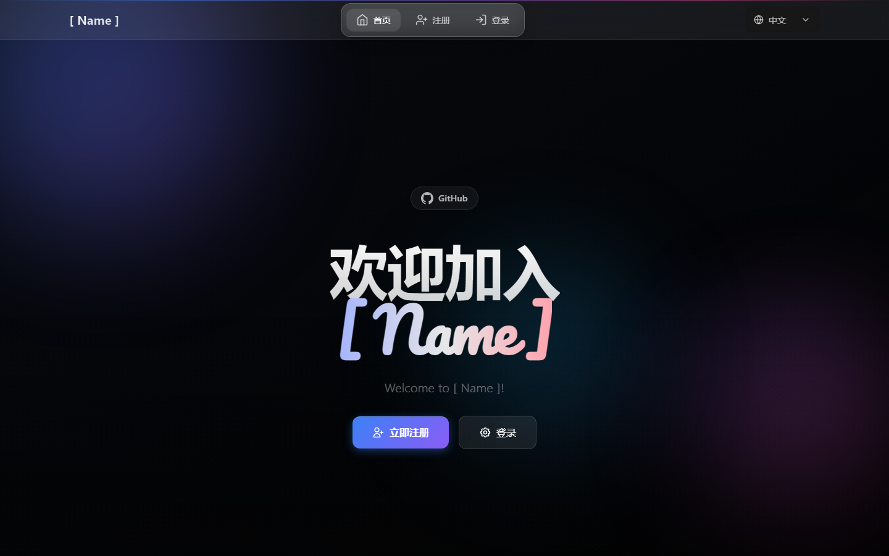
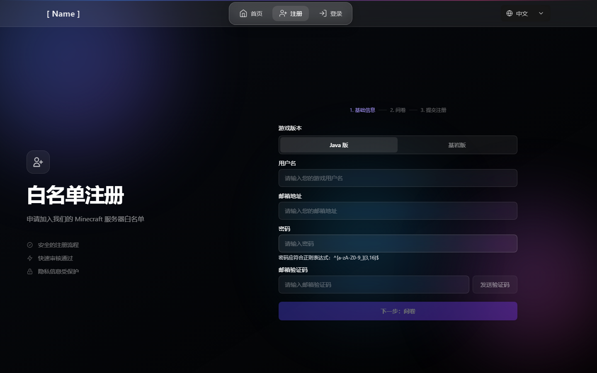
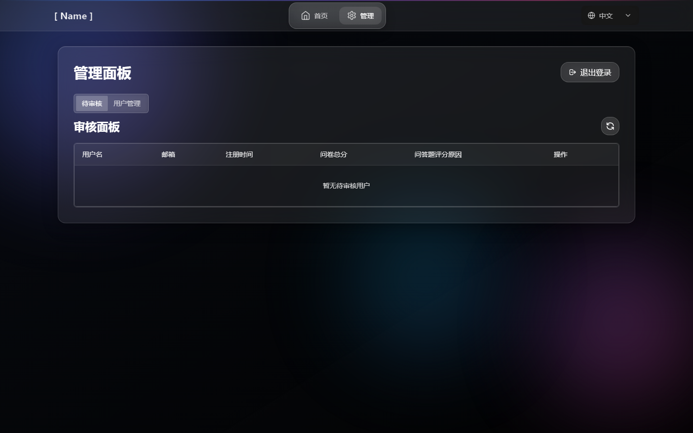

# 🛡️ VerifyMC

[English](README.md) | 简体中文 | [📚 官方文档](https://kitemc.com/zh/docs/verifymc/)

---

## 🚀 项目简介

**VerifyMC** 是一款极致轻量、功能强大的 Minecraft 服务器白名单管理插件，支持网页注册、自动/手动审核、封禁、主题切换、AuthMe 集成与高度自定义，助力服务器安全与社区管理。

---

## 📝 主要功能

1. 🖥️ **网页注册与审核**：玩家可通过网页提交白名单申请，管理员可在线审核、封禁、管理玩家。
2. 🔒 **自动/手动审核**：支持自动通过或管理员手动审核，灵活适配不同服务器需求。
3. 🚫 **封禁系统**：支持对违规玩家进行封禁，保障服务器安全。
4. 🎨 **GlassX 主题**：精美的玻璃拟态设计，流畅动画与现代化界面。
5. 📨 **邮件验证与域名白名单**：集成 SMTP 邮箱验证码，支持邮箱域名白名单与别名限制。
6. 🔐 **自托管图形验证码**：内置图形验证码（数学题/文字）- 无需外部服务。
7. 🎮 **Discord 集成**：OAuth2 Discord 账户绑定，支持可选/强制模式。
8. 📋 **注册问卷**：可自定义问卷系统，支持多语言。
9. 📧 **用户通知**：白名单审核通过/拒绝时自动发送邮件通知。
10. 🌐 **多语言支持**：支持中英文界面与消息。
11. ⚙️ **高度定制化**：自定义单邮箱账号上限、玩家ID正则、免白名单IP等。
12. 🪶 **轻量级**：插件本体体积小于6MB，集成多种功能，运行高效。
13. 🔄 **自动更新与备份**：配置文件自动升级，升级前自动备份数据。
14. 🧩 **灵活白名单模式**：支持 Bukkit 原生白名单同步、插件自管理，以及 MySQL 存储。
15. 💾 **MySQL 与本地文件存储**：可在配置中自由切换本地文件和 MySQL 存储，支持自动迁移。
16. 📝 **审核日志多存储**：审核日志可存储于本地文件或 MySQL。
17. 🌍 **自定义多语言国际化**：自动加载任意 messages_xx.properties 文件，用户可自定义任意语言。
18. 🔐 **AuthMe 集成**：与 AuthMe 插件无缝集成，支持密码管理和自动注册。
19. 🎮 **基岩版支持**：支持 Geyser/Floodgate 玩家前缀，实现跨平台服务器兼容。
20. 🔗 **代理支持**：BungeeCord/Velocity 代理插件，实现群组级白名单管控。

---

## 🖼️ 截图预览（GlassX 主题）

### 首页



### 注册页



### 管理后台



---

## 🛠️ 技术栈

- Java（Bukkit/Spigot/Paper/Folia 插件）
- 前端：Vue3 + Tailwind CSS（支持自定义主题）
- WebSocket 实时通信
- 邮件服务：SMTP

---

## 📊 Bstats


---

## 📦 安装与配置

1. 下载最新版 `VerifyMC.jar`，放入服务器 `plugins` 目录。
2. 启动服务器自动生成配置文件，按需编辑 `config.yml`（见下方完整示例）。
3. 重启服务器，访问 `http://你的服务器IP:8080` 进入管理后台。

### ✅ 建议最低环境

- Java 17+
- Bukkit/Spigot/Paper/Folia 1.20+
- 可公网访问并启用 HTTPS 的域名（生产环境强烈建议）
- SMTP 邮箱账号（当使用 `email` 验证方式时必需）

### ⚡ 5 分钟快速开始

1. 在 `config.yml` 中设置 `auth_methods: [captcha]`（最快启动方式，无需 SMTP）。
2. 设置 `whitelist_mode: plugin` 和 `web_register_url: https://your-domain.com/`。
3. 将 `admin.password` 修改为强密码。
4. （可选）小型私服可开启 `register.auto_approve: true`。
5. 重启服务器并访问 `http://你的服务器IP:8080`。

### 🧪 从源码构建

```bash
cd plugin
mvn clean package
```

产物 jar：`plugin/target/verifymc-<version>.jar`

```yaml
# ----------------------------------------
# 全局设置
# ----------------------------------------
# 全局语言设置，影响插件消息和网页界面。(例如 'zh', 'en')
language: zh
# 开启后，控制台会输出详细的日志，用于故障排查。
debug: false

# ----------------------------------------
# 网页服务器
# ----------------------------------------
# 网页服务使用的端口。
web_port: 8080
# 显示在网页界面上的服务器名称。
web_server_prefix: '[ Name ]'

# ----------------------------------------
# 验证与白名单
# ----------------------------------------
# 支持的验证方式。可选: 'email'（邮箱验证码）, 'captcha'（图形验证码）。
# 可以同时使用多种方式，例如: [email, captcha]
# 
# 【重要】仅配置下方的 captcha: 部分不会启用图形验证码！
# 要启用图形验证码，必须在此列表中添加 'captcha'：
#   仅使用图形验证码: auth_methods: [captcha]
#   同时使用邮箱和图形验证码: auth_methods: [email, captcha]
auth_methods:
  - email
# 单个邮箱最多可以绑定的游戏账号数量。
max_accounts_per_email: 2
# 白名单模式: 'bukkit' (与服务器的 whitelist.json 同步) 或 'plugin' (使用插件内部数据库)。
whitelist_mode: plugin
# 在 'plugin' 模式下，向未在白名单中的玩家显示的注册URL。
web_register_url: https://domain.com/

# ----------------------------------------
# 注册
# ----------------------------------------
# 如果为 true，新用户注册将自动通过。如果为 false，则需要管理员手动审核。
register:
  auto_approve: false

# ----------------------------------------
# 用户与安全
# ----------------------------------------
# 用于验证玩家名的正则表达式。
username_regex: "^[a-zA-Z0-9_-]{3,16}$"
# 如果为 false，则仅大小写不同的用户名（例如 "Player" 和 "player"）将被视为相同。
username_case_sensitive: false
# 允许免白名单登录服务器的IP地址列表。
whitelist_bypass_ips:
  - 127.0.0.1
# 访问网页管理面板的密码。
admin:
  password: your_custom_password

# ----------------------------------------
# 用户通知
# ----------------------------------------
# 当管理员审核用户申请后，向用户发送邮件通知。
user_notification:
  # 是否启用用户通知功能
  enabled: true
  # 审核通过时是否发送通知邮件
  on_approve: true
  # 审核拒绝时是否发送通知邮件
  on_reject: true

# ----------------------------------------
# 前端 (UI)
# ----------------------------------------
frontend:
  # 网页界面的视觉主题。可选: 'glassx'。
  theme: glassx
  # Logo 的 URL。可以是网页链接或本地文件路径 (例如 '/logo.png')。
  logo_url: /logo.png
  # 显示在主页上的公告信息。
  announcement: 欢迎来到[ Name ]!

# ----------------------------------------
# 邮箱 (SMTP)
# ----------------------------------------
smtp:
  host: smtp.qq.com
  port: 587
  username: your_email@qq.com
  password: your_email_password
  from: your_email@qq.com
  enable_ssl: true
# 验证码邮件的主题（标题）
email_subject: VerifyMC Verification Code

# ----------------------------------------
# 同步设置 (用于 bukkit 模式)
# ----------------------------------------
# 如果为 true，会自动将 whitelist.json 的变更同步到插件数据库。
whitelist_json_sync: true
# 如果为 true，会自动将已批准的玩家添加到 whitelist.json，并移除被封禁/删除的玩家。
auto_sync_whitelist: true
# 如果关闭了 'bukkit' 模式，此项若为 true，则会从 whitelist.json 清理本插件添加过的玩家。
auto_cleanup_whitelist: true

# ----------------------------------------
# 自动更新与备份
# ----------------------------------------
# 如果为 true，插件更新时会自动向 config.yml 中添加新增的配置项。
auto_update_config: true
# 如果为 true，将自动更新语言文件。
auto_update_i18n: true
# 如果为 true，将自动更新邮件模板。
auto_update_email: true
# 如果为 true，将自动更新主题文件。
auto_update_static: true
# 如果为 true，将在自动更新前完整备份插件数据文件夹。
backup_on_update: true 

# ----------------------------------------
# 邮箱注册限制
# ----------------------------------------
# 是否启用邮箱域名白名单
enable_email_domain_whitelist: true
# 是否限制邮箱别名（如禁止 user+xxx@gmail.com）
enable_email_alias_limit: false
# 邮箱域名白名单，留空则使用默认主流邮箱域
email_domain_whitelist:
  - gmail.com
  - 163.com
  - 126.com
  - qq.com
  - outlook.com
  - hotmail.com
  - icloud.com
  - yahoo.com
  - foxmail.com 

# ----------------------------------------
# 存储与数据迁移
# ----------------------------------------
storage:
  # 存储类型，可选: data（本地文件）, mysql（外部数据库）
  type: data
  # 是否在 storage.type 切换时自动将原存储的数据迁移到新存储（如 data→mysql 或 mysql→data）
  auto_migrate_on_switch: false
  mysql:
    host: localhost
    port: 3306
    database: verifymc
    user: root
    password: yourpassword 

# ----------------------------------------
# Authme集成配置
# ----------------------------------------
authme:
  # 是否启用Authme集成功能
  enabled: true
  # 是否强制在Web注册时要求输入密码
  require_password: true
  # 是否在通过审核时自动注册至Authme
  auto_register: false
  # 是否在删除用户时自动从Authme注销
  auto_unregister: false
  # 密码正则表达式
  password_regex: "^[a-zA-Z0-9_]{3,16}$"

# ----------------------------------------
# 图形验证码配置
# ----------------------------------------
# 图形验证码可作为邮箱验证的替代或补充方案
# 在 auth_methods 中添加 'captcha' 来启用: auth_methods: [captcha]
# 或同时使用两种验证: auth_methods: [email, captcha]
captcha:
  # 验证码类型: math（数学表达式）或 text（随机字符）
  type: math
  # 文本验证码长度（math 类型时忽略此项）
  length: 4
  # 验证码过期时间（秒）
  expire_seconds: 300

# ----------------------------------------
# 基岩版玩家支持
# ----------------------------------------
# 适用于 Geyser/Floodgate 的基岩版玩家
bedrock:
  # 是否启用基岩版玩家支持
  enabled: false
  # 基岩版玩家用户名前缀（Floodgate 常用 "."）
  prefix: "."
  # 基岩版用户名正则表达式
  username_regex: "^\\.[a-zA-Z0-9_\\s]{3,16}$"

# ----------------------------------------
# 问卷调查配置
# ----------------------------------------
# 详细问题配置请参见 questionnaire.yml
questionnaire:
  # 是否启用问卷功能
  enabled: false
  # 通过所需的最低分数
  pass_score: 60
  # 问卷通过后是否自动批准用户
  auto_approve_on_pass: false

# ----------------------------------------
# Discord集成（OAuth2）
# ----------------------------------------
# 需要在 https://discord.com/developers/applications 创建 Discord 应用
discord:
  # 是否启用 Discord 集成
  enabled: false
  # Discord 应用的客户端ID
  client_id: ""
  # Discord 应用的客户端密钥
  client_secret: ""
  # OAuth2 回调地址
  redirect_uri: "https://yourdomain.com/api/discord/callback"
  # 可选：要求用户加入特定服务器的ID
  guild_id: ""
  # 是否强制要求绑定 Discord 才能注册
  required: false
```

---

## 💬 官方社区

- **QQ 群**: 1041540576 ([点击加入](https://qm.qq.com/q/F7zuhZ7Mze))
- **Discord**: [https://discord.gg/TCn9v88V](https://discord.gg/TCn9v88V)

---

> ❤️ 如果你喜欢本项目，欢迎 Star、分享与反馈！
